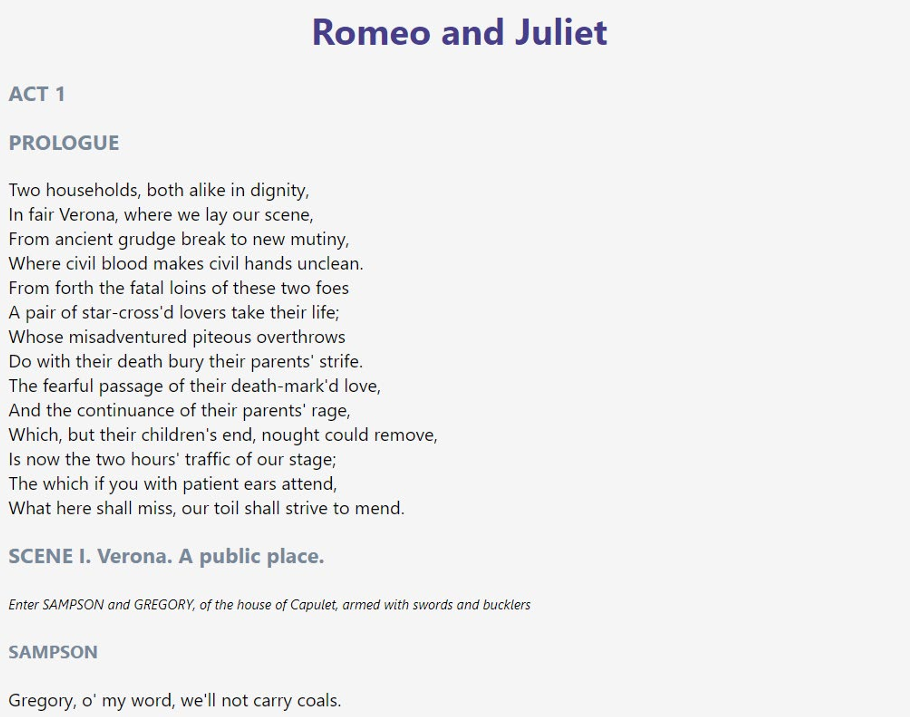
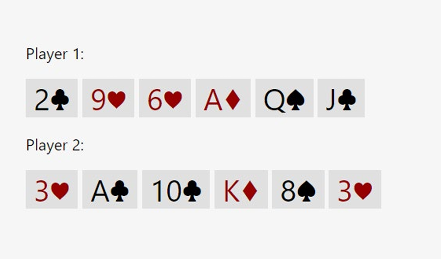

`Домашня робота №1`

## Форматування тексту за допомогою HTML та CSS

За допомогою мов HTML та CSS створити вебсторінки за наданими нижче зображеннями.

### 1. Сторінка "Romeo and Juliet"

Текст до завдання

    Romeo and Juliet

    ACT 1

    PROLOGUE

    Two households, both alike in dignity,
    In fair Verona, where we lay our scene,
    From ancient grudge break to new mutiny,
    Where civil blood makes civil hands unclean.
    From forth the fatal loins of these two foes
    A pair of star-cross'd lovers take their life;
    Whose misadventured piteous overthrows
    Do with their death bury their parents' strife.
    The fearful passage of their death-mark'd love,
    And the continuance of their parents' rage,
    Which, but their children's end, nought could remove,
    Is now the two hours' traffic of our stage;
    The which if you with patient ears attend,
    What here shall miss, our toil shall strive to mend. 

    SCENE I. Verona. A public place.

    Enter SAMPSON and GREGORY, of the house of Capulet, armed with swords and bucklers

    SAMPSON

    Gregory, o' my word, we'll not carry coals.

    GREGORY

    No, for then we should be colliers.

### 2. Сторінка "Card game"

Спеціальні символи можна [взяти тут](https://symbl.cc/en/html-entities/).

---

У MyStat потрібно завантажити код сторінок та скриншоти їх вигляду у браузері або посилання на проєкт у [CodePen](https://codepen.io/).

---
[string-badge]:https://img.shields.io/badge/string-green?style=flat
[decimal-badge]:https://img.shields.io/badge/decimal-blue?style=flat