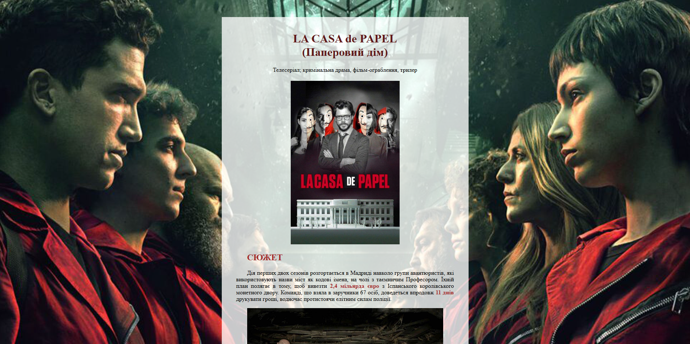
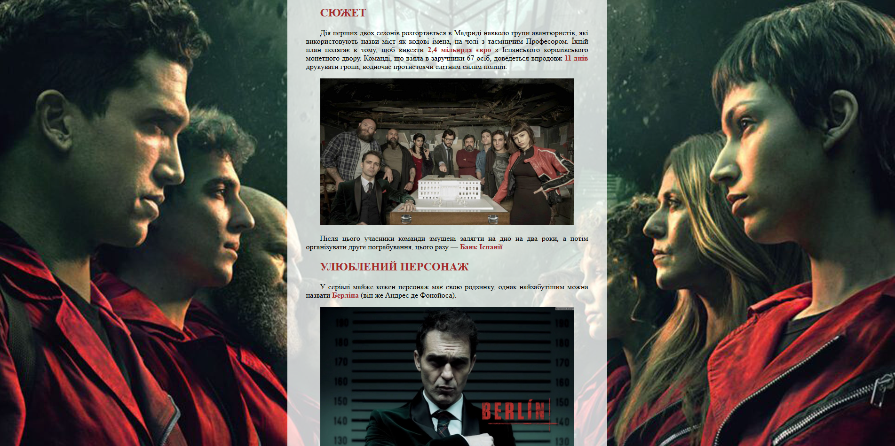

`Домашня робота №2`

## Створення вебсторінки улюбленого твору

Створити вебсторінку, в якій **розповісти про свій улюблений
фільм/мультфільм/книгу/серіал/аніме** тощо.
На сторінці необхідно вказати наступне:
1. Назва
2. Тип (фільм, серіал і т.д.) та жанр
3. Сюжет (коротко описати)
4. Улюблений персонаж (описати хто та чому)
5. Загальне враження (що сподобалося/не сподобалося)

Пункти 3, 4 та 5 доповнити зображеннями. Спочатку вставити постер обраного твору. Текст можна взяти із Інтернету або розписати самостійно. 

Форматувати сторінку, додавши у кожен заголовок тег `<h2>`, а кожен абзац тег `<p>`. Важливі моменти виділити за допомогою тегів `<b>`, `<i>`, `<u>` і т.д.

Підібрати кольори для тексту (різні для головного заголовка, вторинних заголовків та основного тексту). Як фон сторінки використовувати зображення (зафіксувати за допомогою `background-attachment: fixed;` ). Для всього тексту зробити окреме одноколірне напівпрозоре тло.

### Приклад сторінки:



Приклад у CodePen: https://codepen.io/editor/fmudqsyk-the-sans/pen/01a0d79b-5e89-7945-bb03-1a6e53160d4a

<details>
<summary>Код сторінки (якщо не грузить CodePen)</summary>

### `index.html`

```html
<!DOCTYPE html>
<html lang="uk">
<head>
    <meta charset="UTF-8">
    <title>LA CASA de PAPEL</title>
    <link rel="stylesheet" type="text/css" href="style.css">
</head>
<body>
    <div class="main">
        <h1>LA CASA de PAPEL<br>(Паперовий дім)</h1>
        <h4>Телесеріал; кримінальна драма, фільм-ограблення, трилер</h4>

        <!-- Зображення взято в блок div для вирівнювання по центру -->
        <div class="image">
            <!-- 
                alt має бути на кожному зображенні!
                
                За потреби можна вказувати стилі через атрибут style,
                якщо потрібно індивідуально підлаштувати параметри (не зловживати!)
            -->
            
        </div>

        <h2>СЮЖЕТ</h2>
        <p>
            Дія перших двох сезонів розгортається в Мадриді навколо групи авантюристів, які використовують назви міст як кодові імена, на чолі з таємничим Професором. Їхній план полягає в тому, щоб вивезти <b>2,4 мільярда євро</b> з Іспанського королівського монетного двору. Команді, що взяла в заручники 67 осіб, доведеться впродовж <b>11 днів</b> друкувати гроші, водночас протистоячи елітним силам поліції.
        </p>

        <div class="image">
            
        </div>

        <p>
            Після цього учасники команди змушені залягти на дно на два роки, а потім організувати друге пограбування, цього разу — <b>Банк Іспанії</b>.
        </p>

        <h2>УЛЮБЛЕНИЙ ПЕРСОНАЖ</h2>
        <p>
            У серіалі майже кожен персонаж має свою родзинку, однак найзабутішим можна назвати <b>Берліна</b> (він же Андрес де Фонойоса).
        </p>

        <div class="image">
            
        </div>

        <p>
            La Voz de Galicia охарактеризувала Берліна як <b>«холодного, гіпнотичного, вишуканого та тривожного</b> персонажа, закоренілого маскуліна з серйозними проблемами співчуття, злодія-білого комірця, який зневажає своїх колег і вважає їх нижчими». Хоана Олівейра з El País описала Берліна в частинах 1 і 2 як «<b>огидного</b>» і «<b>сноба, жінконенависника та трохи садиста</b>», що La Vanguardia протиставила зображенню персонажа в спогадах у частині 3, де він здавався «<b>набагато більш закоханим і приємним</b>».
        </p>

        <div class="image">
            
        </div>

        <p>
            Актор Педро Альонсо описав Берліна як «<b>жорстокого, героїчного і смішного одночасно</b>» і побачив високі спостережливі здібності Берліна та незвичайне розуміння свого оточення, що призвело до нетрадиційної та непередбачуваної поведінки персонажів. Попри здатність до співчуття, Берлін часто не показував цього і був «<b>глибоко людяним і дуже палким</b>», що спричиняло хаос в його взаємодії з іншими. Альонсо пояснив популярність Берліна бажанням персонажа жити і «<b>інтенсивно насолоджуватися всім у даний момент</b>», проживаючи «життя як фантастичний сон [...] з великою чесністю, не дотримуючись умовностей і моралі».
        </p>

        <h2>ЗАГАЛЬНЕ ВРАЖЕННЯ</h2>
        <p>
            Серіал захоплює своїм сюжетом і задумкою. На початку, коли йдеться про пограбування, ти навіть не здогадуєшся про те, як саме це все станеться. І рішення, ухвалені як у плані, так і на місці, вражають і водночас захоплюють.
        </p>

        <div class="image">
            
        </div>

        <p>
            Втім, саме це і псує серіал в окремих місцях. Оповідь серіалу йде паралельно в теперішньому й минулому, де Професор пояснює всім план. І з часом <b>набридає те, що всі несподівані повороти були спочатку передбачені та сплановані</b>.
        </p>
        <p>
            Також варто зауважити, що в перших двох сезонах деталі набагато ретельніше прораховані, ніж в інших. Наприклад, зв'язок: у першому сезоні зв'язок із Професором тримався <b>виключно по проводовому телефону</b>, щоб їхні розмови не засекла поліція. У продовженні ж команда спокійно <b>спілкується через супутник</b>, жодної секунди не хвилюючись, що їхня розмова стане надбанням громадськості.
        </p>
    </div>
</body>
</html>
```

### `style.css`

```css
body {
    background-color: #2f4b38;
    background-image: url('https://github.com/svitlyi-itstep/college-web-2yr-26-27/blob/0db128acb1e49ba33f6bd92421c26c2288eefd68/Homeworks/images/hw1_example/bg.jpg?raw=true');
    background-size: cover;
    background-attachment: fixed;
    background-position: center;
}

div.main {
    /*
        margin використано для відступів від країв сторінки
        Перше значення - відступ по вертикалі
        Друге значення - відступ по горизонталі (auto центрує)
    */
    margin: 50px auto;
    /*
        padding використано для створення відступів від країв блоку
        (щоб текст не прилипав до краю)
    */
    padding: 20px 40px;
    /*
        max-width дозволяє обмежити ширину блоку
        Якщо батьківський блок менший - даний блок буде
        підганятися під батьківський
    */
    max-width: 600px;
    background-color: #ffffffc6;
}

div.image {
    /*
        Вирівнювання тексту (у нашому випадку зображення) по центру
    */
    text-align: center;
}

div.image img {
    width: 90%;
}

h1 {
    color: #5f1919;
    text-align: center;
}

h4 {
    text-align: center;
    /*
        Забирає жирність шрифту
    */
    font-weight: normal;
}

h2 {
    color: brown;
    /*
        Абзацний відступ
    */
    text-indent: 30px;
}

p {
    /*
        Вирівнювання тексту по ширині
        (текст розтягується на всю ширину)
    */
    text-align: justify;
    text-indent: 30px;
}

b {
    color: brown;
}
```

</details>

---

У MyStat потрібно завантажити код сторінок та скриншоти їх вигляду у браузері або посилання на проєкт у [CodePen](https://codepen.io/).

---